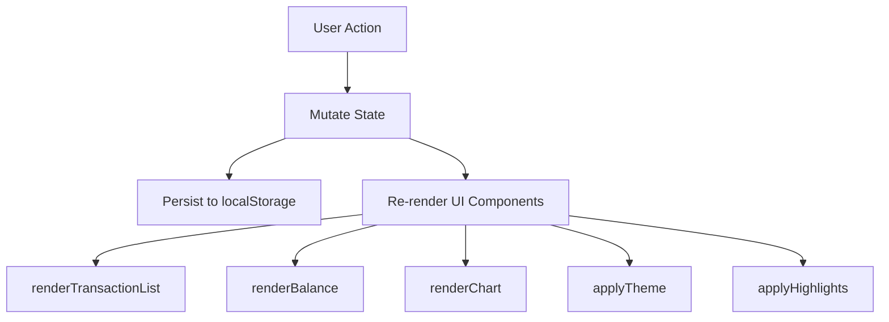

# Design Document: Expense & Budget Visualizer

## Overview

The Expense & Budget Visualizer is a single-page, client-side web application built with plain HTML, CSS, and Vanilla JavaScript. It enables users to record spending transactions, view a live total balance, visualize spending by category via a pie chart, and manage their transaction history — all without a backend or build tools.

The app is structured as three files:
- `index.html` — entry point and markup
- `css/style.css` — all styling, including theme variables
- `js/app.js` — all application logic

Optional features included:
1. Dark/Light Mode Toggle
2. Sort Transactions by amount or category
3. Highlight Spending Over a Set Limit

Data is persisted entirely in `localStorage`. The charting library (Chart.js) is loaded via CDN.

---

## Architecture

The app follows a simple **data-driven rendering** pattern:

1. A single in-memory `state` object holds all application data.
2. Every user action mutates `state`, persists to `localStorage`, and triggers a full re-render of affected UI components.
3. There is no virtual DOM or reactive framework — DOM updates are performed directly by render functions.



### Module Responsibilities (within `js/app.js`)

| Module / Section | Responsibility |
|---|---|
| `state` object | Single source of truth for transactions, theme, sort order, spending limit |
| Storage helpers | Read/write `localStorage` |
| Validator | Validate form inputs before submission |
| Transaction CRUD | Add and delete transactions |
| Render functions | Update DOM for list, balance, chart, theme, highlights |
| Event listeners | Wire up all user interactions |
| Init | Load state from storage and perform initial render |

---

## Components and Interfaces

### HTML Structure (`index.html`)

```
<body>
  <header>
    <h1>Expense & Budget Visualizer</h1>
    <button id="theme-toggle">🌙 Dark Mode</button>
  </header>

  <main>
    <!-- Balance Display -->
    <section id="balance-section">
      <h2>Total Spent</h2>
      <p id="balance-display">$0.00</p>
    </section>

    <!-- Input Form -->
    <section id="form-section">
      <form id="transaction-form">
        <input type="text" id="item-name" placeholder="Item name" />
        <span id="error-name" class="error"></span>
        <input type="number" id="item-amount" placeholder="Amount" min="0.01" step="0.01" />
        <span id="error-amount" class="error"></span>
        <select id="item-category">
          <option value="">Select category</option>
          <option value="Food">Food</option>
          <option value="Transport">Transport</option>
          <option value="Fun">Fun</option>
        </select>
        <span id="error-category" class="error"></span>
        <button type="submit">Add Transaction</button>
      </form>
    </section>

    <!-- Spending Limit -->
    <section id="limit-section">
      <label for="spending-limit">Spending Limit ($)</label>
      <input type="number" id="spending-limit" placeholder="Set limit..." min="0" step="0.01" />
    </section>

    <!-- Sort Controls -->
    <section id="sort-section">
      <label for="sort-select">Sort by:</label>
      <select id="sort-select">
        <option value="none">None</option>
        <option value="amount-asc">Amount (Low → High)</option>
        <option value="amount-desc">Amount (High → Low)</option>
        <option value="category-asc">Category (A → Z)</option>
      </select>
    </section>

    <!-- Transaction List -->
    <section id="list-section">
      <ul id="transaction-list"></ul>
      <p id="empty-state" class="hidden">No transactions yet.</p>
    </section>

    <!-- Chart -->
    <section id="chart-section">
      <canvas id="spending-chart"></canvas>
      <p id="chart-empty" class="hidden">Add transactions to see the chart.</p>
    </section>
  </main>
</body>
```

### JavaScript Interfaces (`js/app.js`)

#### State Object

```js
const state = {
  transactions: [],   // Transaction[]
  theme: 'light',     // 'light' | 'dark'
  sortOrder: 'none',  // 'none' | 'amount-asc' | 'amount-desc' | 'category-asc'
  spendingLimit: null // number | null
};
```

#### Transaction Object

```js
{
  id: string,       // crypto.randomUUID() or Date.now().toString()
  name: string,     // item name
  amount: number,   // positive number
  category: string  // 'Food' | 'Transport' | 'Fun'
}
```

#### Key Functions

```js
// Storage
function loadState()                    // reads localStorage, populates state
function saveState()                    // serializes state to localStorage

// Validation
function validateForm()                 // returns { valid: boolean, errors: object }

// CRUD
function addTransaction(name, amount, category)
function deleteTransaction(id)

// Rendering
function renderAll()                    // calls all render functions
function renderTransactionList()        // renders sorted + highlighted list
function renderBalance()                // updates balance display
function renderChart()                  // updates Chart.js pie chart
function applyTheme(theme)              // adds/removes 'dark' class on <html>
function applyHighlights()              // adds/removes 'over-limit' class on list items

// Sorting
function getSortedTransactions()        // returns sorted copy of state.transactions

// Event Handlers
function onFormSubmit(e)
function onDeleteClick(id)
function onThemeToggle()
function onSortChange(e)
function onLimitChange(e)
```

---

## Data Models

### Transaction

| Field | Type | Constraints |
|---|---|---|
| `id` | `string` | Unique, non-empty, generated at creation |
| `name` | `string` | Non-empty, trimmed |
| `amount` | `number` | Positive (`> 0`), finite |
| `category` | `string` | One of `'Food'`, `'Transport'`, `'Fun'` |

### AppState (localStorage key: `"expense-app-state"`)

| Field | Type | Default |
|---|---|---|
| `transactions` | `Transaction[]` | `[]` |
| `theme` | `'light' \| 'dark'` | `'light'` |
| `sortOrder` | `'none' \| 'amount-asc' \| 'amount-desc' \| 'category-asc'` | `'none'` |
| `spendingLimit` | `number \| null` | `null` |

### localStorage Schema

All state is stored under a single key:

```
localStorage["expense-app-state"] = JSON.stringify(state)
```

### CSS Theme Variables

```css
:root {
  --bg: #ffffff;
  --text: #111111;
  --card-bg: #f5f5f5;
  --accent: #4a90e2;
  --highlight: #ffe0e0;
}

html.dark {
  --bg: #1a1a2e;
  --text: #e0e0e0;
  --card-bg: #16213e;
  --accent: #e94560;
  --highlight: #5c1a1a;
}
```

---

## Correctness Properties

*A property is a characteristic or behavior that should hold true across all valid executions of a system — essentially, a formal statement about what the system should do. Properties serve as the bridge between human-readable specifications and machine-verifiable correctness guarantees.*

**Property Reflection:** Before listing properties, redundancies were eliminated:
- Requirements 3.2 and 3.3 (balance updates on add/delete) are subsumed by Property 3 (balance always equals sum).
- Requirements 4.2 and 4.3 (chart updates on add/delete) are subsumed by Property 4 (chart data always reflects current transactions).
- Requirement 5.2 (persistence on add/delete) is covered by Properties 1 and 5 (add/delete round-trips).
- Requirements 10.4 and 11.3–11.4 are subsumed by Properties 7 and 8 respectively.
- Requirements 9.3 and 9.4 are combined into a single theme persistence round-trip property.

---

### Property 1: Transaction add round-trip

*For any* valid transaction (non-empty name, positive amount, valid category), after calling `addTransaction`, the transaction should appear in `state.transactions` and the serialized `localStorage` entry should contain that transaction's data.

**Validates: Requirements 1.2, 5.2**

---

### Property 2: Form validation rejects incomplete inputs

*For any* combination of missing or empty form fields (name, amount, or category), `validateForm()` should return a validation result with `valid: false` and an error entry for each missing field.

**Validates: Requirements 1.3**

---

### Property 3: Balance equals sum of all transaction amounts

*For any* array of transactions with arbitrary positive amounts, the value computed by the balance calculation function should equal the arithmetic sum of all transaction amounts.

**Validates: Requirements 3.1, 3.2, 3.3**

---

### Property 4: Chart data reflects current transactions

*For any* set of transactions, the data object produced for the chart should contain exactly one entry per category present in the transactions, with each entry's value equal to the sum of amounts for that category.

**Validates: Requirements 4.1, 4.2, 4.3**

---

### Property 5: Transaction delete round-trip

*For any* transaction that exists in `state.transactions`, after calling `deleteTransaction(id)`, that transaction's id should not appear in `state.transactions` and should not appear in the serialized `localStorage` entry.

**Validates: Requirements 2.3, 5.2**

---

### Property 6: State persistence round-trip

*For any* app state (transactions, theme, sortOrder, spendingLimit), serializing it to `localStorage` and then calling `loadState()` should produce a state object equal to the original.

**Validates: Requirements 5.1, 5.2**

---

### Property 7: Sort correctness

*For any* array of transactions and any sort option (`amount-asc`, `amount-desc`, `category-asc`), `getSortedTransactions()` should return a copy of the transactions in the correct order for that option, while leaving `state.transactions` in its original insertion order.

**Validates: Requirements 10.2, 10.3, 10.4**

---

### Property 8: Spending limit highlight correctness

*For any* spending limit value and any set of transactions, every transaction whose amount strictly exceeds the limit should be classified as over-limit, and every transaction whose amount is less than or equal to the limit should not be classified as over-limit.

**Validates: Requirements 11.2, 11.3, 11.4**

---

### Property 9: Theme toggle is a round-trip

*For any* starting theme (`'light'` or `'dark'`), calling `onThemeToggle()` twice should return the UI to the original theme, and calling it once should apply the opposite theme and persist it to `localStorage`.

**Validates: Requirements 9.2, 9.3, 9.4**

---

## Error Handling

| Scenario | Handling Strategy |
|---|---|
| Form submitted with empty name | Validator shows inline error on name field; submission blocked |
| Form submitted with empty/zero/negative amount | Validator shows inline error on amount field; submission blocked |
| Form submitted with no category selected | Validator shows inline error on category field; submission blocked |
| `localStorage` read fails (e.g., private mode quota) | `try/catch` around all storage calls; app falls back to empty in-memory state |
| `localStorage` write fails | `try/catch`; silently continues — data is still in memory for the session |
| `localStorage` contains malformed JSON | `try/catch` around `JSON.parse`; falls back to default empty state |
| Chart.js not loaded (CDN failure) | Chart section hidden; rest of app remains functional |
| `crypto.randomUUID` unavailable | Fallback to `Date.now().toString() + Math.random()` for ID generation |
| Spending limit input is non-numeric or negative | Input ignored; limit remains unchanged |

---

## Testing Strategy

### Unit Tests (example-based)

Focus on specific behaviors and edge cases:

- Form renders with all required fields (name input, amount input, category select) — **Req 1.1**
- Empty state message is shown when `state.transactions` is `[]` — **Req 2.4**
- Theme toggle button exists in the DOM — **Req 9.1**
- Sort controls exist in the DOM — **Req 10.1**
- Spending limit input exists in the DOM — **Req 11.1**
- Default theme is `'light'` when no preference in storage — **Req 9.5**
- Default spending limit is `null` when no limit in storage — **Req 11.7**
- Chart shows placeholder when all transactions are removed — **Req 4.4**

### Property-Based Tests

Property-based testing is applicable here because the core logic (validation, balance calculation, chart data aggregation, sorting, highlight classification, persistence) consists of pure functions with clear input/output behavior and universal properties that hold across a wide input space.

**Library**: [fast-check](https://github.com/dubzzz/fast-check) (JavaScript, no install required via CDN or npm)

**Configuration**: Minimum 100 iterations per property test.

**Tag format**: `// Feature: expense-budget-visualizer, Property N: <property_text>`

| Property | Test Description |
|---|---|
| Property 1 | Generate random valid transactions; verify add round-trip in state and localStorage |
| Property 2 | Generate all combinations of missing fields; verify validateForm returns correct errors |
| Property 3 | Generate random arrays of positive amounts; verify balance sum is correct |
| Property 4 | Generate random transaction sets; verify chart data has correct categories and sums |
| Property 5 | Generate random transaction lists; pick random transaction; verify delete removes it from state and storage |
| Property 6 | Generate random full state objects; verify serialize → loadState round-trip |
| Property 7 | Generate random transaction arrays; verify getSortedTransactions returns correct order for each sort option without mutating state |
| Property 8 | Generate random limit values and transaction amounts; verify highlight classification is correct |
| Property 9 | Generate random starting themes; verify toggle switches theme and double-toggle restores original |

### Integration / Smoke Tests

- App loads and renders without errors in Chrome, Firefox, Edge, Safari
- All UI components visible on 375px viewport without horizontal scroll
- App functions when opened as a local file (`file://` protocol)
- Chart.js loads from CDN and renders correctly
- No network requests made during normal app usage (DevTools Network tab)
